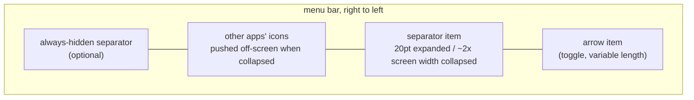
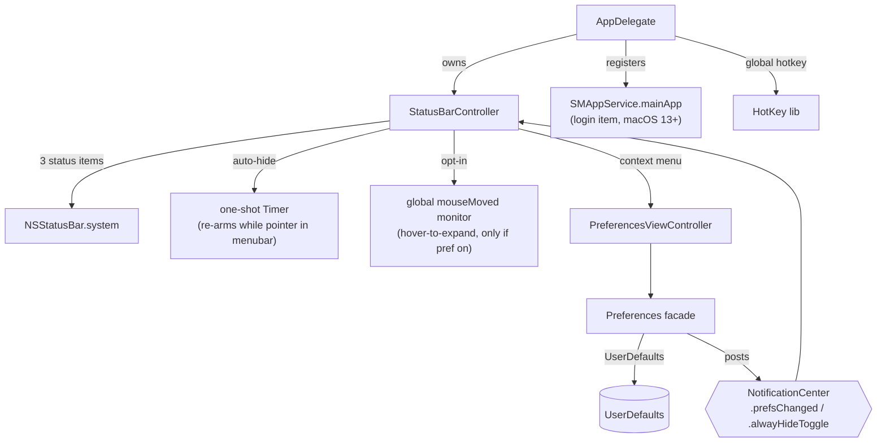

# Architecture

Hidden Bar is a single-process, sandboxed AppKit menubar utility (~1.5k lines of
Swift, one dependency: [HotKey](https://github.com/soffes/HotKey)). There is no
helper app, no daemon, no network. Everything happens inside three
`NSStatusItem`s and one window.

## The core trick

macOS offers no API to hide other apps' menubar icons. Hidden Bar fakes it with
geometry: a separator status item whose **length is inflated to roughly the
width of the widest attached screen**, shoving every icon to its left off-screen.
Collapsing and expanding is just flipping that length between ~20pt and the
inflated value.

Key consequences of this design:

- The menubar replicates on every display, so the collapse length derives from
  the **widest** screen (`NSScreen.screens`), never `NSScreen.main`, and is
  re-applied to the live item on `didChangeScreenParametersNotification`
  (display hot-plug).
- The length is bounded: `max(500, min(widestFrameWidth * 2, 10_000))`. macOS
  enforces a hard 10,000pt maximum on `NSStatusItem.length`.
- `isCollapsed` is derived state: `separator.length > 20`, deliberately not an
  equality check, so it survives the length being recomputed while collapsed.
- Icons macOS inserts to the LEFT of the separator (where new status items
  appear) are in the hidden zone by default; that is inherent to the trick.

## Topology

- **`AppDelegate`** (entry): registers default prefs, sets up the global hotkey,
  runs the one-shot legacy login-item migration, owns the `StatusBarController`.
- **`StatusBarController`** (the product, ~370 lines): the three status items,
  collapse/expand, auto-hide timer, interaction-awareness, hover-to-expand,
  self-restore of dragged-off items.
- **`Preferences`** (facade enum): typed accessors over `UserDefaults`; setters
  post `NotificationCenter` notifications that the controller and prefs window
  observe. There is no other state store.
- **`PreferencesViewController` / `PreferencesWindowController`**: the only
  window (storyboard-based), shown on demand from the context menu.

## Behavior layers on the core trick

| Layer | Mechanism | Cost when unused |
|---|---|---|
| Auto-hide | one-shot `Timer` after expand; at fire, if the pointer sits in any screen's menubar band (`visibleFrame.maxY ... frame.maxY`), it re-arms instead of collapsing | none (single point-in-rect check at fire) |
| Hover-to-expand (opt-in) | global `.mouseMoved` monitor + 0.5s dwell timer; installed only when the `hoverToExpand` default is true at launch | zero: monitor not installed |
| Self-restore | `isVisible = true` forced on our items at launch; Cmd-dragging them off otherwise bricks the app (its only UI is those items) | none |
| Always-hidden section | a second separator item; its own length games, gated by `alwaysHiddenSectionEnabled` | item not created |

## Autostart

macOS 13+ `SMAppService.mainApp`: the app registers itself; the login item is
visible and revocable in System Settings > General > Login Items. On first
launch after upgrade, a one-shot migration deauthorizes the legacy
`com.dwarvesv.LauncherApplication` helper registration (the BTM database never
garbage-collects those; see Apple TN3111). The helper app itself is gone.

## Security posture

Sandboxed (`com.apple.security.app-sandbox`), hardened runtime, no network
entitlement, no file I/O, no IPC surface, no shell or subprocess use. The only
dependency is HotKey (a small Carbon `RegisterEventHotKey` wrapper) locked by
the committed `Package.resolved`. The opt-in hover monitor observes pointer
position only and discards event payloads. About-window links are hardcoded.
A full-tree audit (2026-06) scored 9/10 with hygiene-level findings only.

## Known architectural limits

- **The notch**: hidden icons sit "under" the notch area on notched Macs; the
  trick cannot reveal them there. The real fix is a spillover/second-bar design
  (tracked in issues #357/#341/#148; candidate implementations in PRs #350/#358).
- **macOS 27**: the menu bar re-architecture in macOS 27 betas
  (`NSMenuBarNavigationSceneExtension`) breaks length-inflation hiding entirely
  (issue #360). A different mechanism may be required.
- **Other apps' open menus**: interaction-awareness is pointer-position-based;
  a pointer deep inside another app's open dropdown is below the menubar band,
  so the collapse can still fire there.
